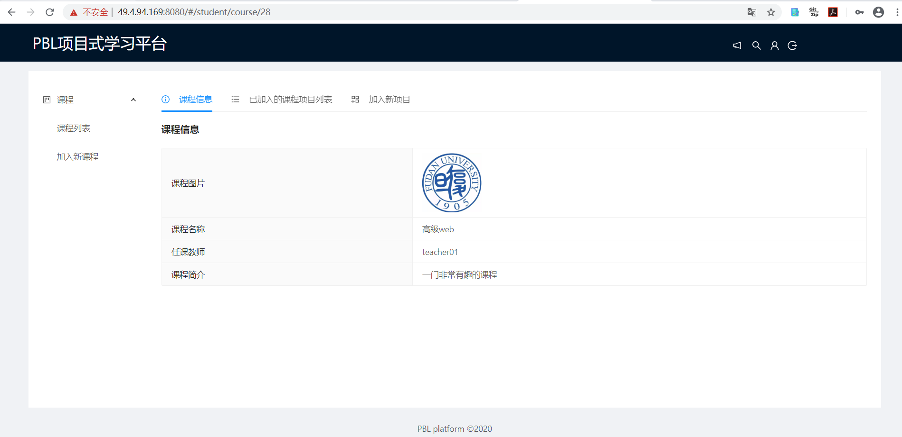

# PBL项目设计文档

小组：第二组  
组长：俞继涛  
组员：王永立、姜向阳、赵骞云   
项目部署地址：http://49.4.94.169:8080/  
项目代码地址：https://github.com/Jedar/Project-Based-Learning-System  

## 目录  
[toc]

## 项目概述

## 前端设计

### 前端技术栈

| **技术类型**   | **技术名称**        |
| -------------- | ------------------- |
| 前端框架       | Angular        |
| 前端组件库   | NG-ZORRO |
| 甘特图   | jsGantt |
| 统计图    | Echarts            |

### 前端框架

```shell script
.
├── app-routing.module.ts
├── app-share.module.ts
├── app.component.css
├── app.component.html
├── app.component.ts
├── app.module.ts
├── components
│   ├── footer-content
│   │   ├── footer-content.component.css
│   │   ├── footer-content.component.html
│   │   └── footer-content.component.ts
│   ├── header-logo
│   │   ├── header-logo.component.css
│   │   ├── header-logo.component.html
│   │   └── header-logo.component.ts
│   ├── page-error
│   │   ├── page-error.component.css
│   │   ├── page-error.component.html
│   │   └── page-error.component.ts
│   └── page-unauthorized
│       ├── page-unauthorized.component.css
│       ├── page-unauthorized.component.html
│       └── page-unauthorized.component.ts
├── ng-zorro-antd.module.ts
├── pages
│   ├── auth
│   │   ├── auth-main
│   │   ├── auth-routing.module.ts
│   │   ├── auth.module.ts
│   │   ├── example
│   │   ├── manager-login
│   │   ├── student-login
│   │   ├── student-signup
│   │   └── teacher-login
│   ├── manager
│   │   ├── manager-class
│   │   ├── manager-class-chart
│   │   ├── manager-class-create
│   │   ├── manager-main
│   │   ├── manager-project
│   │   ├── manager-project-chart
│   │   ├── manager-project-create
│   │   ├── manager-routing.module.ts
│   │   ├── manager-student
│   │   ├── manager-student-create
│   │   ├── manager-system
│   │   ├── manager-teacher
│   │   ├── manager-teacher-create
│   │   └── manager.module.ts
│   ├── project
│   │   ├── pj-all-task
│   │   ├── pj-discuss
│   │   ├── pj-edit-task
│   │   ├── pj-file
│   │   ├── pj-info
│   │   ├── pj-manage-info
│   │   ├── pj-manage-task
│   │   ├── pj-mark-mate
│   │   ├── pj-mark-score
│   │   ├── pj-modify-task
│   │   ├── pj-my-score
│   │   ├── pj-my-task
│   │   ├── pj-student-main
│   │   ├── pj-teacher-main
│   │   ├── project-routing.module.ts
│   │   └── project.module.ts
│   ├── student
│   │   ├── course-card
│   │   ├── course-info
│   │   ├── course-join
│   │   ├── course-list
│   │   ├── course-main
│   │   ├── info
│   │   ├── memo-list
│   │   ├── modify-info
│   │   ├── project-join
│   │   ├── project-list
│   │   ├── student-main
│   │   ├── student-routing.module.ts
│   │   └── student.module.ts
│   ├── teacher
│   │   ├── course-add
│   │   ├── course-info
│   │   ├── course-list
│   │   ├── course-main
│   │   ├── info
│   │   ├── modify-info
│   │   ├── project-add
│   │   ├── project-list
│   │   ├── teacher-main
│   │   ├── teacher-routing.module.ts
│   │   └── teacher.module.ts
│   └── welcome
│       ├── welcome
│       ├── welcome-routing.module.ts
│       └── welcome.module.ts
├── services
│   ├── auth.service.ts
│   ├── common.service.ts
│   ├── course.service.ts
│   ├── discussion.service.ts
│   ├── file.service.ts
│   ├── manager.service.ts
│   ├── memo.service.ts
│   ├── project.service.ts
│   ├── score.service.ts
│   ├── student.service.ts
│   ├── task.service.ts
│   ├── teacher.service.ts
│   └── upload-file.service.ts
└── share
    ├── CommonValidator.ts
    ├── MyInterceptor.ts
    ├── Token.ts
    ├── common.model.ts
    ├── course.model.ts
    ├── dicussion.model.ts
    ├── file.model.ts
    ├── memo.model.ts
    ├── project.model.ts
    ├── score.model.ts
    ├── student.model.ts
    ├── task.model.ts
    └── teacher.model.ts
```

下面是前端架构的简单介绍：

```shell script
web-pbl/src/app

├─ components   公共组件
├─ pages        主体页面，下分多个模块
├─ services     自定义服务
└─ share        封装前后端交互的实体对象

web-pbl/src/assets

├─ data         前端开发时使用的虚拟数据
├─ image        项目中使用的图片
└─ js           js文件，主要在echarts中使用
```

### 前端页面展示
这里仅展示部分页面，更多页面请访问项目网站：http://49.4.94.169:8080/

登录页面


注册页面


课程列表页面


课程主页页面


项目主页页面


任务页面


讨论页面


打分页面(以互评为例)


管理员页面(这里仅展示学生列表页面)

## 后端设计

### 后端技术栈

| **技术类型**   | **技术名称**        |
| -------------- | ------------------- |
| 后端框架       | Spring  Boot        |
| 数据库访问层   | Mybatis，通用Mapper |
| JSON数据封装   | Fastjson            |
| JWT身份验证    | Java-jwt            |
| 前后端接口文档 | Swagger             |
| 接口测试       | Postman             |
| 代码框架生成器 | freemaker           |

### 后端框架概述

我们的后端是基于 Spring Boot 框架进行搭建的，数据库方面使用了 Mybatis 框架。

我们使用了很方便的代码生成器来生成数据库中每一个实体对应的实体类以及数据访问层、业务层和控制层文件等，然后我们根据需要修改和新增需要的实体类，以及相应的Mapper、Service和Controller文件中添加相应的功能即可。使用代码生成器既省去了创建各种类文件的过程，又有一定的编码规范。

另外，我们在后端开发的过程中对功能的实现进行测试。对于每一个Mapper都创建了一个测试类，并对每一个Mapper的所有方法都进行了测试。然后对于Controller的测试，我们使用Postman软件，自定义HTTP请求，从而判断Controller的功能实现是否正确。

为了更好地对接前后端，避免出现各种问题，我们使用了Swagger将接口信息规范化，并生成很详细的接口文档。（Swagger部分后面会详细介绍）

下面是后端目录的简单介绍

```shell script
.
├─ annotation   用户权限验证的注解
├─ configurer   配置文件
├─ controller   控制层
├─ core         通用Mapper、后端返回数据等相关的类
├─ dao          数据访问层
├─ interceptor  拦截器
├─ pojo         实体类集合
├─ request      
├─ service      业务层接口
│  └─ impl      业务层实现
└─ utils        工具类集合
```

### 数据访问层

数据访问层主要是对接数据库，进行数据库的访问以及进行数据的操作。每个Mapper类都对应着一个Mapper XML文件，Mapper类中定义数据库操作的接口，而真正的SQL语句是写在Mapper XML文件中的。

```shell script
.
├── CourseMapper.java      课程
├── DiscussionMapper.java  讨论
├── FileMapper.java        文件
├── MemoMapper.java        任务提醒
├── ProjectMapper.java     课程项目
├── ScoreMapper.java       评分
├── StudentMapper.java     
├── TaskMapper.java        项目任务
├── TeacherMapper.java
└── UserMapper.java        用户（包括学生老师管理员）
```
### 业务层

业务层主要负责所有的后端功能的实现，供控制层调用。业务层主要是通过调用Mapper来进行数据库操作。

```shell script
.
├── CourseService.java       课程
├── DiscussionService.java   讨论
├── FileService.java         文件增加查看删除等
├── IUploadService.java      文件上传到服务器
├── MemoService.java         任务提醒
├── ProjectService.java      项目
├── ScoreService.java        评分
├── StudentService.java      
├── TaskService.java         项目任务
├── TeacherService.java
├── UserService.java         用户（包括学生老师和用户）
└── impl                     以上Service接口的实现
```

### 控制层

控制层主要是负责与前端进行交互，接收并处理从前端传递过来的请求信息，然后调用相应的Service（业务层）类进行各种的操作和处理。

这里的`VerifyController.java`是负责后端生成验证码以及验证码的验证，其他的都是各种实体如user、project对应的相关操作。

```shell script
.
├── CourseController.java       课程
├── DiscussionController.java   讨论
├── FileController.java         文件
├── HelloController.java        
├── MemoController.java         任务提醒
├── ProjectController.java      项目
├── ScoreController.java        评分
├── StudentController.java
├── TaskController.java         项目任务
├── TeacherController.java
├── UploadController.java       文件上传
├── UserController.java         用户（包括学生老师和管理员）
└── VerifyController.java       验证码生成和验证
```

### 工具包

`utils`文件夹，是一些工具类的集合

```
.
├── FileNameUtil.java  文件上传时获取文件后缀以及根据日期生成文件存储路径的工具类
├── JWTTokenUtil.java  JWT Token工具类
├── VerifyUtil.java    验证码生成及存储工具类
```

## 关键功能的实现

### 评分功能

数据库设计 

score表：记录了项目ID(project_id)、用户ID(user_id)、分数类型(score_type:1：学生自评 2：学生互评 3：教师评价)、评分人ID(scorer_id)、分数(value)、打分时间(time)和评论(comment);{project_id,user_id,score_type,scorer_id}为主键。
score_distribute表:记录了一个项目的评分分布，包括project_id,type,distribute(分数占比)三个字段。  

功能设计  
1. 评分细分：
    学生自评，学生互评，教师评价。
    
2. 评分时间限定：
    项目设置了评分时间，学生可以在评分时间内进行互评和自评，在规定时间之外不开启评分的入口。  
    
3. 查看任务完成情况和讨论板留言情况：
    在评分面板可以查看评分学生的参与的任务和任务完成的情况，可以查看发布的讨论的数目和回复的讨论数。
    
4. 互评计算：
    当前登录学生在评分时间内可以对其他学生都进行互评，互评的分数取所有学生对该学生的评分后求平均值。
    
5. 评分次数：
    自评、互评和教师评价都只有一次机会，提交了分数之后不可再次提交或修改。

功能展示
    


### 甘特图
#### 甘特图框架安装与介绍
我们组使用的Gantt图组件是[jsgantt-improved](https://github.com/jsGanttImproved/ng-gantt)，这个组件各方面封装得很好，使用方便。
```
# 安装
npm install --save jsgantt-improved ng-gantt

# 在app.module中引入框架
import { NgGanttEditorModule } from 'ng-gantt' 
@NgModule({
  declarations: [
    AppComponent
  ],
  imports: [
    ....,
    NgGanttEditorModule
  ],
  providers: [],
  bootstrap: [AppComponent]
})
export class AppModule { }

# 在style.css中引入甘特图的样式增强效果
@import "~jsgantt-improved/dist/jsgantt.css";
```

除了Angular，JsGantt也提供了Vue和React的版本，扩展性高。

#### 甘特图的配置
在使用甘特图之前，需要对甘特图进行配置。接下来展示创建的配置选项以及在项目中我们使用的配置。具体的也可以参考[官网的配置选项](https://github.com/jsGanttImproved/jsgantt-improved/blob/master/Documentation.md)。

```typescript
/* 额外的属性 */
const vAdditionalHeaders = {
    pTaskUser: {
    	title: '负责人'
    },
    pTime: {
    	title: '持续时间'
    },
    pPriority: {
    	title: '优先级'
    }
};
/* 完整配置信息 */
this.editorOptions = {
      vCaptionType: 'Complete',/* 常见值：None,Caption,Resource,Duration,Complete*/
      vQuarterColWidth: 200, /* 控制季度页面每一个季度的显示长度 */
      vDateTaskDisplayFormat: 'day dd month yyyy', /* 任务显示日期格式 */
      vDayMajorDateDisplayFormat: 'mon yyyy - Week ww', /* 日期模式下日期格式 */
      vWeekMinorDateDisplayFormat: 'dd mon', /* 周模式下日期格式 */
      vLang: this.vLang, /* 甘特图语言，这里配置为中文 */
      vUseSingleCell: '0', /* 不需要的特性，0禁用，1开启 */
      vShowRes: 0,/* 禁用 */
      vShowCost: 0,/* 禁用 */
      vShowComp: 0,/* 禁用 */
      vShowDur: 0,/* 禁用 */
      vShowStartDate: 0,/* 禁用 */
      vShowEndDate: 0,/* 禁用 */
      vShowPlanStartDate: 0,/* 禁用 */
      vShowPlanEndDate: 0,/* 禁用 */
      vShowTaskInfoLink: 0, /* 禁用 */
      vShowEndWeekDate: 0,/* 禁用 */
      vAdditionalHeaders: vAdditionalHeaders,/* 自定义属性 */
      vResources: [], /* 不需要的特性 */
      vTooltipTemplate: this.getToolTip, /* 自定义任务详情 */
      vEventClickRow: console.log, /* 点击事件，这里简单log */
      vTooltipDelay: 150, /* 任务详情展示的延迟 */
      vDebug: false, /* 禁用 */
      vEditable: false,/* 禁用 */
      vUseSort: false,/* 禁用 */
      vUseFade:true,/* 启用 */
      vFormatArr: ['Day', 'Week', 'Month', 'Quarter'],  /* 开启日期模式，周模式，月模式和季度模式 */
      vFormat: 'day',/* 默认日期模式 */
    };
```


#### 甘特图的使用
JsGantt库已经提供了使用接口，我们在调用库时只要将相应的值注入对应的属性即可。
```typescript
interface GanttTask{
  'pID': number,//任务ID
  'pName': string,//任务名称
  'pStart': string,//任务开始时间
  'pEnd': string,//任务结束时间
  'pClass': string,//展示颜色，实现中采用随机颜色
  'pLink': string,
  'pMile': number,
  'pRes': string,
  'pComp': number,//完成比例
  'pGroup': number,
  'pParent': number,
  'pOpen': number,
  'pDepend': string,
  'pCaption': string,
  'pNotes': string,//任务内容
  // 自定义接口
  'pTaskUser':string,//任务负责人
  'pTime':string,//任务持续时间
  'pPriority':number,//任务优先级
}
```

甘特图组件在html页面中可以直接调用。

```html
<div style="height:300px;">
    <ng-gantt [options]="editorOptions" [data]="data" #editor></ng-gantt>
</div>
```

对于一些组件我们觉得展示效果不太理想，也对这些组件做了特性化的处理：

```css
.gmainright{
	max-width: 60%;
}

.gmainleft{
	max-width:40%;
}
```
甘特图效果：


#### 甘特图的思考

我们组其实对甘特图考虑过许多种方案，但是其他方案都有一些问题，例如有一些库不支持日，周，月的切换；有一些添加至Angular中导致无法编译；还有一些定制化程度不够高。我们组经过均衡最终采用现在这个方案。

### 文件上传

#### 文件上传的设计

在Ant Design中，上传文件的步骤与传统的表单提交有所差异。正常的表单提交直接将表单数据和文件一起提交，服务器处理文件的同时处理图片提交请求。在Ant Design的组件中，文件提交与表单的提交是分开的，具体流程为：


#### 前端组件的使用

前端使用Ant Design的上传组件，基本流程与之前提到的一样。

```
----------- HTML -----------
<nz-upload 
nzAction="/file/upload" /* 上传路径 */
nzName="upload_file" /* 资源名称 */
[(nzFileList)]="fileList" /* 资源列表，控制文件数量为1 */
(nzChange)="handleChange($event)" /* 文件上传完成后的操作 */
>
<button nz-button><i nz-icon nzType="upload"></i>Upload</button>
</nz-upload>

-------- Typescript -----
/* 处理上传事件 */
handleChange(info: UploadChangeParam): void {
    let fileList = [...info.fileList];
    /* 上传出错的处理 */
    let flag = false;
    /* 限制上传文件数量 */
    fileList = fileList.slice(-1);
    /* 从相应数据中读取相应路径 */
    fileList = fileList.map(file => {
      if (file.response) {
        // Component will show file.url as link
        if(file.response.code == 200){
          file.url = file.response.data;
        }
        else{
          flag =true;
          this.modal.error({
            nzTitle: '文件上传失败，请稍后再试',
            nzContent: file.response.message,
          });
        }
      }
      return file;
    });
    if(flag){
      fileList = [];ypescript
    }
    this.fileList = fileList;
  }
```


#### 后端处理

文件传递至后端后，后端进行储存，返回访问路径，这里我们将图片上传和文件上传区分开了，方便上传文件类型的管理。

```java
/* Controller */
@ApiOperation(value = "上传文件")
@RequestMapping(value = "/file/upload", method = RequestMethod.POST)
public Result<String> uploadFile(
    @RequestParam(value = "upload_file") MultipartFile file) {
    ResultTypeGenerator<String> generator = new ResultTypeGenerator<>();
    Map<String, String> map = new HashMap<>() ;
    String path=uploadService.uploadFile(file);

    if(path == null){
        logger.info("文件上传失败");
        return generator.genFailResult("文件上传失败");
    }
    return generator.genSuccessResult(path);
}

/* Service */
//支持的文件类型
private static final List<String> RESOURCE_CONTENT_TYPE = Arrays.asList(
            "text/csv","image/gif", "image/jpeg",
       "image/png","text/html","application/pdf",
       "text/plain","application/xml","application/zip"
    );
// 文件的真实路径，在Spring配置文件中
@Value("${file.uploadFolder}")
private String realBasePath;
// 文件访问路径，在Spring配置文件中
@Value("${file.accessPath}")
private String accessPath;
@Override
public String uploadFile(MultipartFile file) {
    return handleFile(file,RESOURCE_CONTENT_TYPE);
}
private String handleFile(MultipartFile file,List<String> fileType){
	// 将文件名进行Hash
    String newFileName = FileNameUtil.getFileName(file.getOriginalFilename());
    String contentType = file.getContentType();
    File dir = new File(realBasePath);
        if(!dir.exists()){
        dir.mkdirs();
    }
    // 文件类型不合法
    if (!fileType.contains(contentType)) {
        logger.info("文件类型不合法:{}", newFileName);
        return null;
    }
    String path = realBasePath+newFileName;
    try {
        File dest = new File(path,"");
        System.out.println(dest.getParentFile());
        // 判断文件父目录是否存在
        if(!dest.getParentFile().exists()){
            dest.getParentFile().mkdir();
        }
        // 储存文件
        file.transferTo(dest);
    } catch (IOException e) {
        logger.error("服务器内部错误->:{}", newFileName);
        e.printStackTrace();
    }
    // 返回访问路径
    return accessPath+newFileName;
}
```
这里需要注意的是前后端的绝对路径不一样，最好将文件储存的路径用不同的配置文件区分开，方便项目从开发环境向部署环境的迁移。

### JWT访问身份验证

#### 使用JWT的原因
基于token的鉴权机制类似于http协议也是无状态的，它不需要在服务端去保留用户的认证信息或者会话信息。所以基于token认证机制的应用不需要去考虑用户在哪一台服务器登录，为应用的扩展提供了便利。

#### Token的组装与解析
Token包括头部，Payload，签名。在PBL项目中，我们需要为指定的User创建Token以及Token的解析。项目对这一功能进行了封装，方面其他功能的调用。

```java
public class JWTTokenUtil {
    private static final long EXPIRATION_TIME = 3600_000L; // 1 hour 有效期
    private static String SECRET = "WEB-PBL";
    // 根据用户获取Token
    public static String getToken(User user) {
        String token="";
        token= JWT.create().withAudience(user.getUserId()+"")
                .withClaim("role", user.getRole())
                .withExpiresAt(new Date(System.currentTimeMillis()+EXPIRATION_TIME))
                .sign(Algorithm.HMAC256(SECRET));
        return token;
    }
    // 从Token获取id
    public static int getId(String token){
        return Integer.parseInt(JWT.decode(token).getAudience().get(0));
    }
    // 验证Token
    public static void verify(String token)throws JWTVerificationException {
        JWTVerifier jwtVerifier = JWT.require(Algorithm.HMAC256(SECRET)).build();
        jwtVerifier.verify(token);
    }
    // 获取权限类型
    public static int getRole(String token) {
        DecodedJWT decodedJWT = JWT.decode(token);
        Claim claim = decodedJWT.getClaim("role");
        return claim.asInt();
    }
}
```
#### 拦截器的实现
在拦截器中需要对请求进行权限控制，根据Controller请求资源的注解进行可扩展的权限设置。拦截器中一方面检查Token的合法性，一方面检查访问者的权限。

```java
// 增加注解，方便Controller进行控制
@Target({ElementType.METHOD, ElementType.TYPE})
@Retention(RetentionPolicy.RUNTIME)
public @interface UserLoginToken {
    boolean required() default true;
    /* Values: None, Student, Manager, Teacher */
    String[] roles() default {"None"};
}

@Override
public boolean preHandle(HttpServletRequest httpServletRequest, HttpServletResponse httpServletResponse, Object object) throws Exception {
        // 从 http 请求头中取出 token
        String token = httpServletRequest.getHeader("token");
        // 如果不是映射到方法直接通过
        if(!(object instanceof HandlerMethod)){
            return true;
        }
        HandlerMethod handlerMethod=(HandlerMethod)object;
        Method method=handlerMethod.getMethod();
        //检查是否有passtoken注释，有则跳过认证
        if (method.isAnnotationPresent(PassToken.class)) {
            PassToken passToken = method.getAnnotation(PassToken.class);
            if (passToken.required()) {
                return true;
            }
        }
        //检查有没有需要用户权限的注解
        if (method.isAnnotationPresent(UserLoginToken.class)) {
            UserLoginToken userLoginToken = method.getAnnotation(UserLoginToken.class);
            String[] roles = userLoginToken.roles();
            if (userLoginToken.required()) {
                // 执行认证
                if (token == null) {
                    failAuth(httpServletRequest,httpServletResponse,"无token，请重新登录");
                    return false;
                }
                // 获取 token 中的 user id
                int userId;
                String role;
                try {
                    userId = JWTTokenUtil.getId(token);
                    role = getRoleString(JWTTokenUtil.getRole(token));
                } catch (JWTDecodeException j) { failAuth(httpServletRequest,httpServletResponse,"token错误");
                    return false;
                }
                /* 检查用户权限 */
                boolean valid = false;
                for(String s : roles){
                    if(s.equals("None")){
                        valid = true;
                        break;
                    }
                    if(role.equals(s)){
                        valid = true;
                        break;
                    }
                }
                if(!valid){
                    failAuth(httpServletRequest,httpServletResponse,"用户权限不足");
                    return false;
                }
                // 验证 token
                try {
                    JWTTokenUtil.verify(token);
                } catch (JWTVerificationException e) {
                    failAuth(httpServletRequest,httpServletResponse,"token错误");
                    return false;
                }
                return true;
            }
        }
        return true;
    }
```

#### 权限控制

在目前的设计下，我们只需要在访问资源加上访问控制的注解就能够实现访问控制的效果。

```java
@UserLoginToken(roles = {"Teacher","Student"})/* 只允许老师和学生使用此资源 */
@ApiOperation(value = "根据项目id返回所有任务列表")
@GetMapping("/all")
public Result<List<HashMap<String,Object>>> getAllTasks(@RequestParam String projectId){
        ResultTypeGenerator<List<HashMap<String,Object>>> generator = new ResultTypeGenerator<>();
        int id;
        try {
            id = Integer.parseInt(projectId);
        }
        catch (Exception e){
            return generator.genFailResult("Get参数错误");
        }
        List<HashMap<String,Object>> list = taskService.getAllTaskListByProject(id);
        return generator.genSuccessResult(list);
}
```


### Swagger接口

[前后端接口文档](http://49.4.94.169:8080/swagger-ui.html#/) 

在项目中我们使用了Swagger UI和Springfox Swagger来生成前后端接口文档。对每个Restful接口，接口的参数，接口的返回数据进行了描述。在SpringBoot项目中整合Springfox Swagger,可以直接通过扫描代码生成接口文档，不需要再去维护描述文件，接口文档是重要的一部分，swagger 工具是为了维护接口文档应运而生的。在实验过程，工具的使用方法是次要的，更为关键的是加深了对前后端分离架构的了解，了解了接口文档在前后端工作的重要性，使用相应的工具如何去维护一个良好的接口文档。  


Swagger页面展示


## 项目部署

项目最终采用Docker部署的方式。

### 前端准备

在项目目录下运行：
```shell script
# 进入前端项目文件
cd web-pbl
# 编译前端文件，如果前端有修改一定需要重新编译
ng build --prod 
```

### 后端准备

+ 编译前请确保spring.properties文件中的配置选项为 prod（必要）

  转换为部署模式。

+ 编译前执行maven clean（必要）

  删除之前的文件，保证环境的正确。

+ 执行maven package编译项目

  编译成功后会在target目录下产生.jar文件，这个就是我们项目的可执行文件。

执行结束后，将jar上传至服务器，方便服务器进行docker部署。可以使用Sftp或者Filezilla工具。

### Docker部署

编写Dockerfile

```
# 容器来自Java8
FROM java:8
# 定义卷，就是挂载点
VOLUME /tmp
# 确保Docker的事件为东八区事件，不加这个可能出现部署后事件差8小时的问题
RUN /bin/cp /usr/share/zoneinfo/Asia/Shanghai /etc/localtime
RUN echo "Asia/Shanghai" > /etc/timezone
# 重命名可执行文件
ADD project-based-learning-0.0.2-SNAPSHOT.jar app.jar
# 测试文件是否存在
RUN bash -c 'touch /app.jar'
# 准备容器（容器运行后的命令）
ENTRYPOINT ["java","-Djava.security.egd=file:/dev/./urandom","-jar","/app.jar"]
```


运行容器

```
# 创建容器
docker build -t projectbasedlearning .
# 运行
docker run -d -p 8080:8080 -v /home/yujitao/web-pbl/:/home/web-pbl/ projectbasedlearning
```

运行命令中，我们使用了-v选项修改了容器运行时的挂载点，方便应用访问外部文件。


### Docker重新部署

部署结束后，可能项目还处于修改的状态，每次修改之后都需要重新部署。

```
cd project-based-learning/
# 查看当前运行容器，查找当前容器的id
docker ps
# 关闭当前运行容器
docker stop [容器id]
# 删除当前运行的容器
docker rm [容器id]
# 查看当前镜像文件列表，查找projectbasedlearning的镜像id
docker images
# 删除projectbasedlearning项目的镜像
docker rmi [镜像id]
# 创建新的镜像
docker build -t projectbasedlearning .
# 运行镜像，具体参数查找相关文档
docker run -d -p 8080:8080 -v /home/yujitao/web-pbl/:/home/web-pbl/ projectbasedlearning
```


## 遇到的问题
1. 后端Result使用错误问题 

  ​		后端Result使用错误问题导致Swagger接口不够详细 

  ​		解决方案: 重新设计响应结果生成的类ResultTypeGenerator  

2. 数据库时区问题 

  ​		解决方案:[数据库时区问题](https://blog.csdn.net/qq_30553235/article/details/79612824) 

  ​			mysql> set global time_zone = '+08:00';
  ​			Query OK, 0 rows affected (0.00 sec)

  ​			mysql> set time_zone = '+08:00';

  ​			Query OK, 0 rows affected (0.00 sec)
3. 评分时，双向数据绑定的问题 

     	 原因： 使用一个固定的变量去绑定所有互评和师评时输入的数据 。

    	  解决方案： 新增数据接口ScoreStudent,添加了value(评分),comment(评论)两个属性，对应学生的评分绑定到对应的值上。  

4. angular表格中的输入框无法使用双向数据绑定的问题 

     	 解决方案： 加上[ngModelOptions]="{standalone: true}"  

5. 前端给后端发送请求时，请求头中token无法解析的问题 

     	 原因： 一开始仿照网上的一些做法，将token设为常量，导致其在初始化时就设好了值，而那时候还没有登录，token是没有值的。 

     	 解决方案：将token设为变量，每次发送请求前从session中读取最新的值。

6. 学生注册时实时判断用户名是否存在问题 

    	  原因： 因为HTTP请求是异步的，在还没有收到返回信息的时候前端就已经进行判断了，所以导致用户名判断不准确。 

    	  解决方案：最后将用户名是否存在的判断放到了点击提交按钮后触发，这样正常情况下已经收到了返回信息了。  

7. Mybatis SQL语句 natural join 会出现重复行 

     	 解决方案： 使用inner join xxx on xxx

## 项目参考

### 前端技术栈资料参考

|技术|描述|
|---|---|
|Angular| [参考链接](https://angular.io/) |
|NG-ZORRO（Ant Design）| [参考链接](https://ng.ant.design/components/button/zh) |

### 后端技术栈资料参考

|技术分类|技术名称|常用链接|
|---|---|---|
|ORM框架|Mybatis|[官网](https://mybatis.org/mybatis-3/zh/index.html),[W3C](https://www.w3cschool.cn/mybatis/),以及课程视频|
|通用Mapper框架|tk.mybatis|[通用Mapper介绍](https://mapperhelper.github.io/docs/)|
|JSON解析|FastJson|[阿里的JSON工具库](https://github.com/Alibaba/fastjson/wiki/%E9%A6%96%E9%A1%B5)|

### 其它资料参考

[项目表单实现参考](https://ng.ant.design/components/form/zh) 

[Swagger介绍与使用](https://www.jianshu.com/p/349e130e40d5) 

[子路由的例子](https://jonny-huang.github.io/angular/training/09_angular_router2/) 

[甘特图的框架](https://github.com/neuronetio/angular-gantt-schedule-timeline-calendar)  


