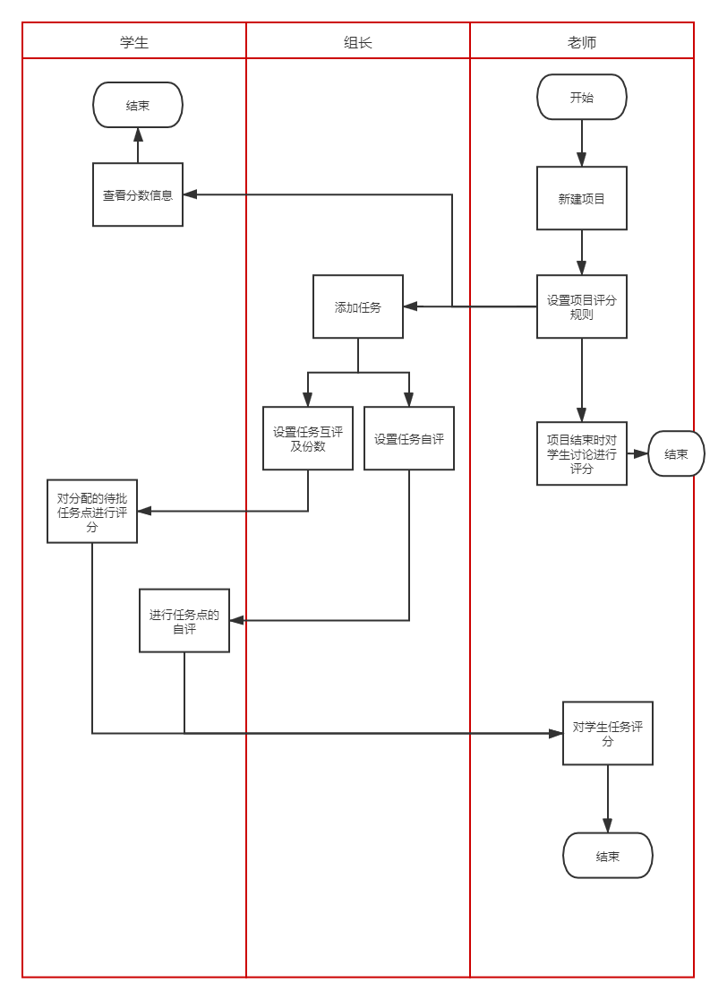

# PBL需求分析  

## 项目概述  
PBL系统结合项目是学习的有关研究，将项目与课程相结合，学生通过在线课程学习，自由
组队，并从感兴趣的项目出发，而不只是单调的听课，来激发学习兴趣，并锻炼动手能力、团队协作能
力。本项目的开发目标是结合PBL思想开发一个类似超星的学习平台。

## 需求综述  
1. 系统角色分析  

    |角色|功能|
    |---|---|
    |教师|开课,新建项目，发布任务，确定评分标准，评分|
    |学生（普通成员）| 加入课程，加入项目，查看任务，完成分配任务，互评，查看评分|
    |学生（组长）|安排任务，新建任务|
    |管理员| 课程管理，账号管理，项目管理|

    项目用况图
    ![][````]

2. 项目数据分析

    |数据|功能|
    |---|---|
    |课程|课程信息|
    |项目|课程内的项目，与课程绑定|
    |任务|项目内有多个任务|
    |文件|项目分享的文件|
    |成绩|项目内每个成员的得分|
    |讨论|项目内讨论区的互动|
    |角色|教师，学生，管理员|
    
    ER图：
    
    
    


3. 项目关键流程分析  

    评分流程泳道图：
    
    
    项目任务状态机图：
    

## 需求详细列表  
1. 公共功能  

    1.1 学生注册 

    |字段|内容/解释|
    |---|---|
    |需求名称| 学生注册账户 |
    |描述| 学生填入名字，性别，学校，密码信息 |
    |参与者| 学生 |
    |结果| 学生账号注册成功 |
    |流程| 填写名字-填写性别-填写学校-填写密码-确认密码 |
    |质量要求| 密码需要重复确认，密码需要加密，空字段检测 |
    
    1.2 登陆  
    
    |字段|内容/解释|
    |---|---|
    |需求名称| 登陆系统 |
    |描述| 学生/教师/管理员登陆系统 |
    |参与者| 学生/教师/管理员 |
    |结果| 登陆系统 |
    |流程| 输入账号，密码，验证码，登陆系统 |
    |质量要求| 密码加密，不同角色有不同登陆界面 |
    
    1.3 信息维护
    
    |字段|内容/解释|
    |---|---|
    |需求名称| 用户信息维护 |
    |描述| 学生/教师 修改个人信息，包括名称，密码，照片等等 |
    |参与者| 学生/教师 |
    |结果| 用户信息修改成功 |
    |流程| 用户进入编辑界面/编辑个人属性/修改成功 |
    |质量要求| 照片功能必做 |
    
2. 教师功能  
    2.1 教师添加课程  
    
    |字段|内容/解释|
    |---|---|
    |需求名称| 添加课程 |
    |描述| 教师新建课程 |
    |参与者| 教师 |
    |结果| 课程添加成功 |
    |流程| 教师添加课程必要信息：课程名称，课程描述，课程人数，科目，*年份。提交表单 |
    |质量要求| 属性检查 |
    
    2.2 教师删除课程
    
    |字段|内容/解释|
    |---|---|
    |需求名称| 删除课程 |
    |描述| 教师删除课程 |
    |参与者| 教师 |
    |结果| 删除成功 |
    |流程| 教师选择删除的课程，判断课程是否有学生，无学生则删除成功 |
    |质量要求|  |
    
    2.3 教师创建项目
    
    |字段|内容/解释|
    |---|---|
    |需求名称| 创建项目 |
    |描述| 教师创建项目 |
    |参与者| 教师 |
    |结果| 新建项目成功 |
    |流程| 教师填写新项目信息：名称，描述，人数，时间，*分数设置，*项目是否公开 |
    |质量要求| 项目也级联删除 |
    
    2.4 教师删除项目
    
    |字段|内容/解释|
    |---|---|
    |需求名称| 删除项目 |
    |描述| 教师删除项目 |
    |参与者| 教师 |
    |结果| 项目删除成功 |
    |流程| 教师选择要删除的项目，若项目内无学生，则删除成功 |
    |质量要求| 删除应当级联删除文件，评论信息 |
    
    2.5 教师查看项目情况
    
    |字段|内容/解释|
    |---|---|
    |需求名称| 查看项目信息 |
    |描述| 教师查看项目信息 |
    |参与者| 教师 |
    |结果| 获取正确项目信息 |
    |流程| 需要查看的信息：项目人员，项目任务列表，任务进度，评论，文件，评分 |
    |质量要求|  |
    
    2.6 课程评分
    
    |字段|内容/解释|
    |---|---|
    |需求名称| 评分 |
    |描述| 教师为项目评分 |
    |参与者| 教师 |
    |结果| 项目评分 |
    |流程| 教师为项目每一个人评分，评分时需要展示讨论，任务信息 |
    |质量要求|  |

3. 组长功能  
    3.1 新增项目任务
    
    |字段|内容/解释|
    |---|---|
    |需求名称| 新增任务 |
    |描述| 项目新增任务 |
    |参与者| 组长/教师 |
    |结果| 任务添加成功 |
    |流程| 增加任务信息：名称，描述，起始时间，终止时间，安排人员 |
    |质量要求|  |
    
    3.2 任务属性编辑
    
    |字段|内容/解释|
    |---|---|
    |需求名称| 编辑任务 |
    |描述| 编辑任务信息 |
    |参与者| 组长/教师 |
    |结果| 任务信息编辑成功 |
    |流程| 编辑需要修改的信息 |
    |质量要求|  |
    
    3.3 查看项目任务完成情况
    
    |字段|内容/解释|
    |---|---|
    |需求名称| 查看完成情况 |
    |描述| 任务完成情况 |
    |参与者| 组长/教师 |
    |结果| 任务列表 |
    |流程| 获取项目所有任务完成情况 |
    |质量要求|  |
    
    3.4 *组长转让
    
    |字段|内容/解释|
    |---|---|
    |需求名称| 组长转让 |
    |描述| 组长将位置给组内成员 |
    |参与者| 组长/教师 |
    |结果| 组长转让成功 |
    |流程| 选择组内成员，确认转让 |
    |质量要求|  |

4. 普通学生功能  
    4.1 加入课程/查看课程
    
    |字段|内容/解释|
    |---|---|
    |需求名称| 加入课程 |
    |描述| 学生加入课程 |
    |参与者| 学生 |
    |结果| 学生加入课程成功 |
    |流程| 学生查看所有课程列表（支持搜索），选择需要加入的课程 |
    |质量要求| 需要考虑需不需要加入课程的限制 |
    
    4.2 加入项目
    
    |字段|内容/解释|
    |---|---|
    |需求名称| 加入课程项目 |
    |描述| 学生加入项目 |
    |参与者| 学生 |
    |结果| 加入项目成功 |
    |流程| 选择要加入的项目，若人数已满，则无法加入 |
    |质量要求|  |
    
    4.3 查看项目信息
    
    |字段|内容/解释|
    |---|---|
    |需求名称| 查看项目信息 |
    |描述| 查看项目基本信息，本人任务，评分，讨论信息，资源信息 |
    |参与者| 学生 |
    |结果| 项目信息 |
    |流程| 选择要展示的项目，未加入的项目无法查看 |
    |质量要求|  |
    
    4.4 自评/互评
    
    |字段|内容/解释|
    |---|---|
    |需求名称| 自评/互评 |
    |描述| 学生为自己或者他人评分 |
    |参与者| 学生 |
    |结果| 评分成功 |
    |流程| 学生为自己或者他人打分，分数上线为100（折算前） |
    |质量要求|  |
    
    4.5 项目评论区-新建讨论主题
    
    |字段|内容/解释|
    |---|---|
    |需求名称| 发表讨论主题 |
    |描述| 发表讨论主题 |
    |参与者| 学生/教师 |
    |结果| 新建讨论主题 |
    |流程| 讨论主题信息：名称，描述，*图片 |
    |质量要求|  |
    
    4.6 项目讨论区-参与讨论
    
    |字段|内容/解释|
    |---|---|
    |需求名称| 参与讨论 |
    |描述| 在讨论主题下发表个人观点 |
    |参与者| 学生/教师 |
    |结果| 新增讨论记录 |
    |流程| 讨论信息：内容，*发表时间 |
    |质量要求|  |
    
    4.7 上传项目文件  
    
    |字段|内容/解释|
    |---|---|
    |需求名称| 上传文件 |
    |描述| 上传项目共享文件 |
    |参与者| 学生/教师 |
    |结果| 项目文件上传成功 |
    |流程| 拖拽/选择需要上传的文件，上传成功 |
    |质量要求| 文件大小限制，文件格式限制（pdf,word,txt,md,图片） |
    
    4.8 下载项目文件  
    
    |字段|内容/解释|
    |---|---|
    |需求名称| 下载指定文件 |
    |描述| 下载项目内文件 |
    |参与者| 学生/教师 |
    |结果| 文件下载成功 |
    |流程| 选择需要下载的文件 |
    |质量要求|  |
    
    4.9 删除项目文件  
    
    |字段|内容/解释|
    |---|---|
    |需求名称| 删除项目文件 |
    |描述| 删除项目内文件 |
    |参与者| 学生/老师 |
    |结果| 文件删除成功 |
    |流程| 选择需要删除的文件，既要删除数据库记录，也要删除服务器文件 |
    |质量要求| 删除需要确认 |
    
    4.10 编辑项目完成情况  
    
    |字段|内容/解释|
    |---|---|
    |需求名称| 编辑任务完成情况 |
    |描述| 学生编辑所属任务的完成情况 |
    |参与者| 学生 |
    |结果| 完成情况变化 |
    |流程| 学生选择任务，编辑任务完成情况 |
    |质量要求| 无法编辑他人的任务 |
    
    4.11 *退出项目
    
    |字段|内容/解释|
    |---|---|
    |需求名称| 退出项目 |
    |描述| 学生退出项目 |
    |参与者| 学生 |
    |结果| 学生从项目人员列表中删除 |
    |流程| 退出项目，项目中相关任务重置，文件所属改变，评论所属改变 |
    |质量要求| 保证项目的完整性 |

5. 管理员  
    5.1 新建教师信息
    
    |字段|内容/解释|
    |---|---|
    |需求名称| 新建教师信息 |
    |描述| 新建教师信息 |
    |参与者| 管理员 |
    |结果|  |
    |流程| 教师所需信息：名称，性别，学校，*联系方式，密码 |
    |质量要求|  |
    
    5.2 查看所有教师信息
    
    |字段|内容/解释|
    |---|---|
    |需求名称| 查看当前所有教师列表 |
    |描述| 查看当前所有教师列表 |
    |参与者| 管理员 |
    |结果|  |
    |流程|  |
    |质量要求|  |
    
    5.3 删除教师
    
    |字段|内容/解释|
    |---|---|
    |需求名称| 删除教师 |
    |描述| 删除教师 |
    |参与者| 管理员 |
    |结果|  |
    |流程| 删除指定教师，如果已开课则无法删除 |
    |质量要求|  |
    
    5.4 新增学生
    
    |字段|内容/解释|
    |---|---|
    |需求名称| 新增学生信息 |
    |描述| 新增学生信息 |
    |参与者| 管理员 |
    |结果|  |
    |流程| 学生信息：名称，性别，学校，密码 |
    |质量要求|  |
    
    5.5 查看所有学生
    
    |字段|内容/解释|
    |---|---|
    |需求名称| 查看所有学生信息 |
    |描述|  |
    |参与者| 管理员 |
    |结果|  |
    |流程| 所有学生基本信息 |
    |质量要求|  |
    
    5.6 删除学生
    
    |字段|内容/解释|
    |---|---|
    |需求名称| 删除指定学生 |
    |描述|  |
    |参与者| 管理员 |
    |结果|  |
    |流程| 删除指定学生，如果学生加入课程，则无法删除 |
    |质量要求|  |
    
    5.7 增加课程
    
    |字段|内容/解释|
    |---|---|
    |需求名称| 新增课程 |
    |描述| 新增课程 |
    |参与者| 管理员 |
    |结果|  |
    |流程| 课程基本信息 |
    |质量要求|  |
    
    5.8 查看课程列表
    
    |字段|内容/解释|
    |---|---|
    |需求名称| 查看课程列表 |
    |描述|  |
    |参与者| 管理员 |
    |结果|  |
    |流程| 获取所有课程列表 |
    |质量要求|  |
    
    5.9 *删除课程
    
    |字段|内容/解释|
    |---|---|
    |需求名称| 删除课程 |
    |描述|  |
    |参与者| 管理员 |
    |结果|  |
    |流程| 删除指定课程，项目也需要删除。若课程存在学生，则无法删除。 |
    |质量要求|  |
    
    5.10 增加项目
    
    |字段|内容/解释|
    |---|---|
    |需求名称| 新增项目 |
    |描述|  |
    |参与者| 管理员 |
    |结果|  |
    |流程| 项目基本信息 |
    |质量要求|  |
    
    5.11 *查看课程所有项目
    
    |字段|内容/解释|
    |---|---|
    |需求名称| 查看课程所有项目 |
    |描述|  |
    |参与者| 管理员 |
    |结果|  |
    |流程|  |
    |质量要求|  |
    
    5.12 *删除项目
    
    |字段|内容/解释|
    |---|---|
    |需求名称| 删除项目 |
    |描述|  |
    |参与者| 管理员 |
    |结果|  |
    |流程| 删除指定项目，*项目内存在学生能够删除 |
    |质量要求|  |


## 技术要求  

使用框架：

|模块|技术|
|---|---|
|前端|Angular|
|后端框架|Spring boot|
|持久化|Mybatis|
|数据库|Mysql|
|运行环境|Docker|

项目架构：


## 注意事项  

需要需求评审

下一步可以考虑原型设计


[````]: ./asserts/usecase.png
