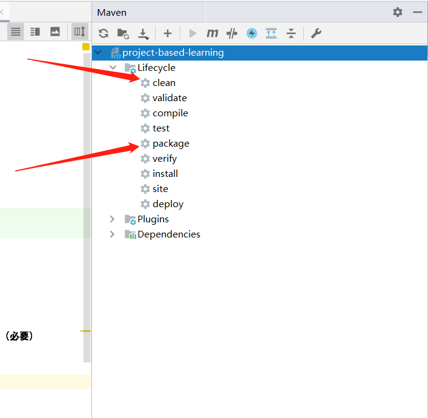
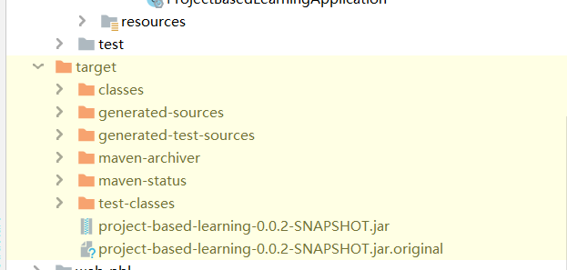
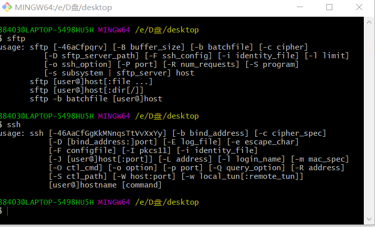

# 项目部署方法

服务器：49.4.94.169  
用户名：yujitao  
密码：yujitao  

## 部署前的准备

### 前端准备
在项目目录下运行：
```shell script
# 进入前端项目文件
cd web-pbl
# 编译前端文件，如果前端有修改一定需要重新编译
ng build --prod 
```

### 后端准备
后端需要注意的问题：

+ 编译前请确保spring.properties文件中的配置选项为 prod（必要）
+ 编译前执行maven clean（必要）
+ 执行maven package编译项目


编译成功后会在target目录下产生.jar文件，这个就是我们项目的可执行文件。


## 连接服务器
打开git bash（就是git手动上传的那个软件）



输入命令：
```shell script
ssh yujitao@49.4.94.169
```
成功后就进入服务器了
```shell script
# 进入项目文件夹
cd project-based-learning/
# 查看Dockerfile，我已经写好了，大家可以看看
cat Dockerfile
# 删除之前的部署文件
rm project-based-learning-0.0.2-SNAPSHOT.jar
```
进入我们的项目位置，将原来的部署文件删除，方便进行重新部署。

## 上传部署文件

！这里使用sftp上传文件，如果你有更好的方法，也可以跳过这一步。  

打开新的git bash,输入，再输入密码就可以准备上传文件了。  
```shell script
sftp yujitao@49.4.94.169
```

输入命令：

```shell script
# 找到本地的target文件
# 这里的路径是我的电脑上的，请使用你们本机的位置，第一个目录是磁盘的意思d就是D盘
lcd /d/Repository/Web/project-based-learning/target/
# 进入服务器上目录
cd project-based-learning/
# 上传文件，上传前请确保之前的删除过程已完成
put project-based-learning-0.0.2-SNAPSHOT.jar
# 关闭sftp连接
exit
```

上传成功后，就可以准备部署了。

## docker部署

docker部署需要使用基本的docker命令。

部署前请确保之前的文件上传成功。  

第一步也是ssh连接服务器。参照上面的ssh连接服务器的方法连接服务器

在服务器上运行以下命令
```shell script
cd project-based-learning/
# 查看当前运行容器，查找当前容器的id
docker ps
# 关闭当前运行容器
docker stop [容器id]
# 删除当前运行的容器
docker rm [容器id]
# 查看当前镜像文件列表，查找projectbasedlearning的镜像id
docker images
# 删除projectbasedlearning项目的镜像
docker rmi [镜像id]
# 创建新的镜像
docker build -t projectbasedlearning .
# 运行镜像，具体参数查找相关文档
docker run -d -p 8080:8080 -v /home/yujitao/web-pbl/:/home/web-pbl/ projectbasedlearning
```

之后就可以打开浏览器访问我们的项目了。
http://49.4.94.169:8080/